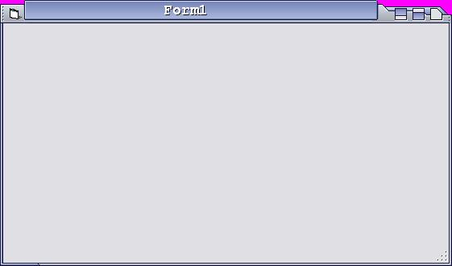



## advanced form skin \+ Transparent w/o  resource graphics\.

### Description

This control does not need any user input. All the user has to do is drag and drop it onto a form and your done. This control does NOT contain any graphics at all, all pictures are drawn from lines and PSET. Many lines of code but all very easy to understand. This control allows you to resize, minumize, maximize/restore, and close the form. It also reads the forms icon and caption and displays it. Also the HotPink areas do become transparent to make this form a little more appealing.

I plan on addins some animation and better buttons to this project. please help me make this better.
 
### More Info
 

             |
---                |---
**Submitted On**   |2004-08-29 18:02:50
**By**             |[Eric Wolcott](https://github.com/Planet-Source-Code/PSCIndex/blob/master/ByAuthor/eric-wolcott.md)
**Level**          |Intermediate
**User Rating**    |4.5 (49 globes from 11 users)
**Compatibility**  |VB 4\.0 \(32\-bit\), VB 5\.0, VB 6\.0
**Category**       |[Custom Controls/ Forms/  Menus](https://github.com/Planet-Source-Code/PSCIndex/blob/master/ByCategory/custom-controls-forms-menus__1-4.md)
**World**          |[Visual Basic](https://github.com/Planet-Source-Code/PSCIndex/blob/master/ByWorld/visual-basic.md)
**Archive File**   |[advanced\_f1787248292004\.zip](https://github.com/Planet-Source-Code/eric-wolcott-advanced-form-skin-transparent-w-o-resource-graphics__1-55882/archive/master.zip)

